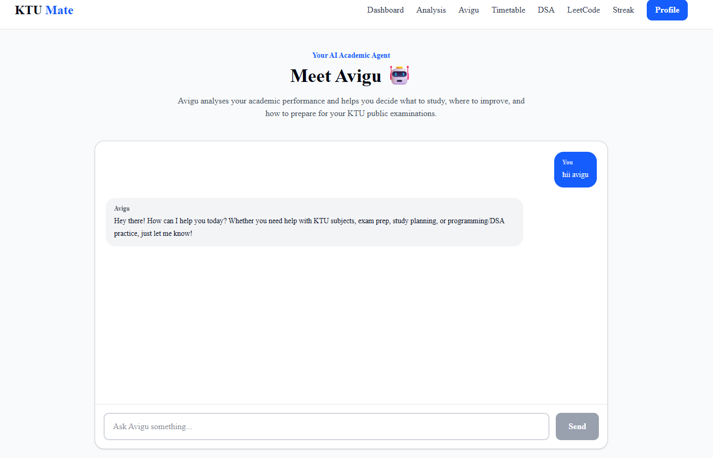
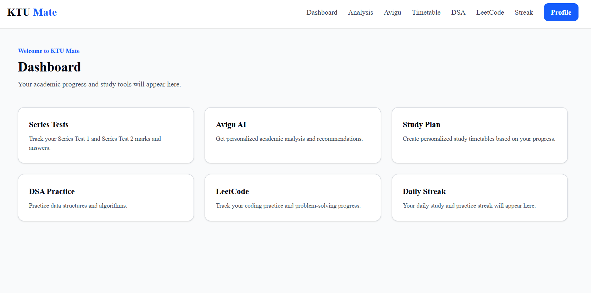
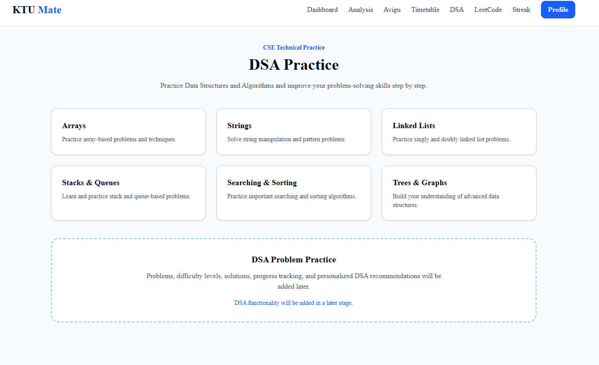
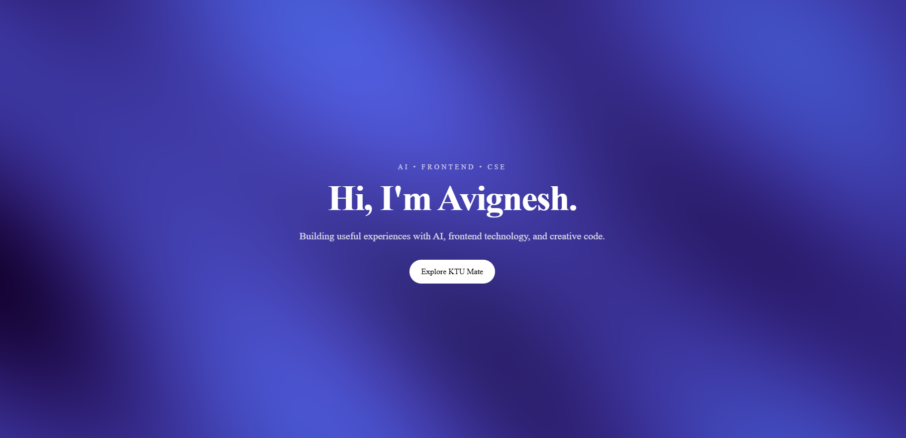

# KTU Mate

**KTU Mate** is an AI-powered academic companion designed for KTU students. It combines AI assistance, DSA progress tracking, study-focused tools, interactive UI experiences, and accessibility/performance-focused frontend engineering in one application.

### Live Application

**Production:** https://ktu-mate.vercel.app

### Developer

**Avignesh T K**

---

## Features

### 🤖 Avigu AI Academic Companion

Avigu is the AI assistant inside KTU Mate.

It can help with:

* KTU exam preparation
* Study planning
* Programming
* Data Structures and Algorithms (DSA)
* Academic questions
* General student-focused guidance

The AI response is streamed to the interface for a more natural chat experience.

---

### 📊 DSA Progress Tool

KTU Mate includes an AI tool for retrieving DSA progress information.

The `dsaProgress` tool provides structured progress data such as:

* Total problems
* Solved problems
* Easy problems
* Medium problems
* Hard problems
* Completion percentage

Avigu uses this tool when the user asks about their DSA progress instead of inventing progress data.

---

### 🎨 GLSL Shader Hero

The project includes a fullscreen animated shader experience built using:

* Three.js
* WebGL
* Custom GLSL fragment shaders
* React

The shader uses interactive uniforms including:

* `u_time`
* `u_resolution`
* `u_mouse`

It also includes:

* Mouse interaction
* Device pixel ratio limiting
* Reduced-motion support
* Pause behavior when the page is hidden
* Readable content over the shader

Route:

`/shader-hero`

---

### 🧊 Interactive 3D Experience

KTU Mate also includes an interactive 3D study experience using:

* React Three Fiber
* Three.js
* React Three Drei

Route:

`/3d`

---

### ♿ Accessibility

Accessibility was treated as part of the frontend implementation rather than as a final-only check.

Implemented and tested areas include:

* Keyboard navigation
* Keyboard-accessible controls
* Screen-reader-friendly live chat updates
* `aria-live="polite"` for streamed responses
* Accessible Stop button
* Reduced-motion handling

A detailed accessibility and performance audit is available in:

`AUDIT.md`

---

### ⚡ Performance

The application was tested with Lighthouse and optimized for frontend performance.

The FE-10 audit recorded:

* Accessibility: **100/100**
* Performance: **90/100**
* First Contentful Paint: **0.5 s**
* Largest Contentful Paint: **0.6 s**
* Total Blocking Time: **0 ms**
* Cumulative Layout Shift: **0**
* Speed Index: **0.5 s**

See `AUDIT.md` for the detailed audit and testing notes.

---

## Tech Stack

| Technology        | Purpose                            |
| ----------------- | ---------------------------------- |
| Next.js 16        | Application framework              |
| React 19          | UI development                     |
| TypeScript        | Type safety                        |
| Tailwind CSS      | Styling                            |
| AI SDK            | AI integration and streaming       |
| Google Gemini     | Avigu AI model                     |
| React Markdown    | Markdown rendering in AI responses |
| React Three Fiber | React-based 3D rendering           |
| Three.js          | 3D/WebGL                           |
| GLSL              | Custom shader effects              |
| Vitest            | Unit/component testing             |
| Testing Library   | UI testing                         |
| Playwright        | End-to-end testing                 |
| Vercel            | Production deployment              |

---

## Application Structure

The project uses the Next.js App Router.

```text
ktu-mate/
│
├── app/
│   ├── api/
│   │   ├── chat/
│   │   │   └── route.ts
│   │   └── health/
│   │       └── route.ts
│   │
│   ├── avigu/
│   ├── dashboard/
│   ├── dsa/
│   ├── leetcode/
│   ├── profile/
│   ├── streak/
│   ├── timetable/
│   ├── 3d/
│   └── shader-hero/
│
├── components/
│   ├── AviguChat.tsx
│   └── ShaderHero/
│
├── lib/
│   └── ai/
│       ├── config.ts
│       └── tools/
│           └── dsaProgress.ts
│
├── tests/
│   ├── AviguChat.test.tsx
│   ├── DsaProgressResult.test.tsx
│   ├── MotionButton.test.tsx
│   └── e2e/
│       └── avigu.spec.ts
│
├── AUDIT.md
├── package.json
└── README.md
```

---

## AI Architecture

The main AI flow is:

```text
User
  ↓
Avigu Chat UI
  ↓
/api/chat
  ↓
AI SDK
  ↓
Google Gemini
  ↓
Streamed response
  ↓
Avigu Chat UI
```

For DSA progress requests:

```text
User asks about DSA progress
          ↓
       Avigu
          ↓
   dsaProgress tool
          ↓
   Structured data
          ↓
       Avigu
          ↓
   User-facing answer
```

The AI route is protected with basic input limits to prevent trivial abuse.

Current limits include:

* Maximum **20 messages** per request
* Maximum **4000 characters** of text per message
* Streaming `maxDuration`: **30 seconds**

---

## Environment Variables

Create a `.env.local` file in the project root.

### Public variables

| Variable               | Example                 | Purpose          |
| ---------------------- | ----------------------- | ---------------- |
| `NEXT_PUBLIC_APP_NAME` | `KTU Mate`              | Application name |
| `NEXT_PUBLIC_APP_URL`  | `http://localhost:3000` | Application URL  |

### AI API key

The Google AI SDK also requires the appropriate Google Generative AI API key environment variable for Avigu.

**Never commit API keys to GitHub.**

A safe `.env.example` should contain placeholders only.

Example:

```env
NEXT_PUBLIC_APP_NAME=KTU Mate
NEXT_PUBLIC_APP_URL=http://localhost:3000
GOOGLE_GENERATIVE_AI_API_KEY=your_api_key_here
```

The actual `.env.local` file must remain private.

---

## Getting Started

### 1. Clone the repository

```bash
git clone https://github.com/avigneshtk/ktu-mate.git
cd ktu-mate
```

### 2. Install dependencies

```bash
npm install
```

### 3. Configure environment variables

Create:

```text
.env.local
```

Add the required application variables and your Google Generative AI API key.

### 4. Start the development server

```bash
npm run dev
```

Open:

```text
http://localhost:3000
```

---

## Available Scripts

### Development

```bash
npm run dev
```

Starts the Next.js development server.

### Production build

```bash
npm run build
```

Creates a production build.

### Production server

```bash
npm run start
```

Runs the production build locally.

### Lint

```bash
npm run lint
```

Runs ESLint.

### Tests

```bash
npm test
```

Runs Vitest.

### Test run

```bash
npm run test:run
```

Runs the test suite once.

---

## Testing

The project uses multiple testing layers.

### Unit / Component Testing

Implemented with:

* Vitest
* Testing Library
* jest-dom
* user-event

Current tests cover areas including:

* Avigu Chat
* DSA progress results
* Motion button interactions

### End-to-End Testing

Playwright is used for browser-level testing.

Example test area:

```text
tests/e2e/avigu.spec.ts
```

---

## Production

KTU Mate is deployed using Vercel.

Production URL:

**https://ktu-mate.vercel.app**

The production deployment includes the main application flow and AI chat endpoint.

Before deployment, the project was checked through a production build using:

```bash
npm run build
```

The build completed successfully.

---

## Browser Testing

The application was tested using:

* Chrome desktop
* Chrome mobile/device emulation

Mobile navigation and the Avigu chat flow were specifically checked during development.

Firefox and Safari were not locally verified because the development environment used for this project was Windows-based.

This README intentionally documents the actual testing performed rather than claiming unsupported browser coverage.

---

## Screenshots

Screenshots of the application will be added here.

### Avigu AI Chat



### Dashboard



### DSA Progress



### Shader Hero


## Design and Engineering Decisions

### Streaming AI responses

AI responses are streamed instead of waiting for the complete response. This provides immediate feedback and makes the chat interaction feel more responsive.

### Input protection

The AI endpoint applies request-level input limits to reduce the risk of trivial API-credit abuse.

### Tool-based DSA data

DSA progress is exposed through an AI tool instead of being generated by the model. This reduces the chance of the assistant inventing progress values.

### Reduced-motion support

The shader experience detects the user's reduced-motion preference and avoids unnecessary animation when reduced motion is requested.

### Performance-conscious WebGL

The shader limits device pixel ratio to avoid unnecessarily expensive rendering on high-DPI displays.

### Accessibility

Keyboard navigation, live-region updates, and accessible controls were tested as part of the frontend workflow.

---

## How AI Tools Were Used to Build KTU Mate

AI tools were used as development assistants throughout the project.

They were used for tasks such as:

* Exploring implementation approaches
* Debugging TypeScript and React issues
* Reviewing frontend architecture
* Improving accessibility
* Generating and refining shader ideas
* Developing AI SDK integrations
* Creating test cases
* Reviewing error states and edge cases
* Improving documentation

The AI tools were not treated as a replacement for testing.

Generated or suggested code was:

1. Reviewed
2. Integrated into the project
3. Built locally
4. Tested
5. Verified in the browser
6. Deployed when appropriate

This workflow was especially important for the AI chat, 3D/WebGL features, accessibility work, and production API protection.

---

## Development Milestones

### FE-06 — Streaming AI Chat

Implemented:

* AI chat interface
* Streaming responses
* Thinking/loading state
* Stop functionality

### FE-07 — Generative UI

Implemented:

* `dsaProgress` AI tool
* Structured DSA progress information
* Tool-based AI responses

### FE-10 — Accessibility & Performance Audit

Implemented and documented:

* Accessibility testing
* Keyboard flow
* Live-region support
* Performance measurements
* Audit documentation

See:

```text
AUDIT.md
```

### FE-AA3 — Signature Shader Hero

Implemented:

* Custom GLSL shader
* Fullscreen animated hero
* Mouse interaction
* Time-based animation
* Resolution-aware rendering
* Reduced-motion behavior
* Hidden-tab pause behavior
* DPR cap

### FE-11 — Production Deployment & Hygiene

Implemented:

* Production deployment
* Production build verification
* AI route input protection
* Message-count limit
* Message-length limit
* Streaming duration limit
* Production documentation

---

## Repository

GitHub:

https://github.com/avigneshtk/ktu-mate

Production:

https://ktu-mate.vercel.app

---

## License

This project is currently a personal/educational project by **Avignesh T K**.
